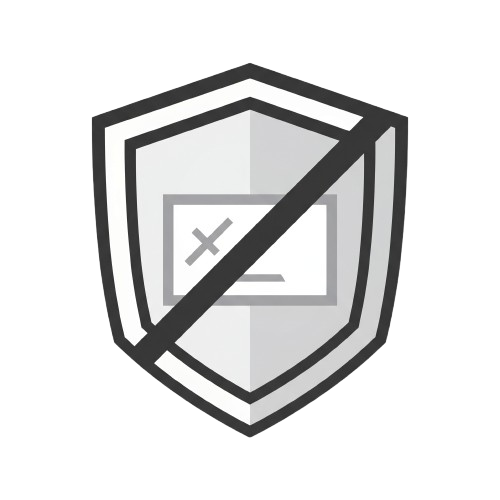

  
  <h1>Dexster NoAds</h1>
  
<strong>Fast, private ad blocking for Android.</strong>

  
Blocks ads, trackers, malware, and phishing domains locally on your device.

  
  

---

## Language ~ أختر اللغة

- [English](#english)
- [العربية](#العربية)

---

## English

### Quick Overview

Dexster NoAds is an Android app that blocks ads and harmful domains using local DNS filtering.
Your traffic is filtered on-device for better privacy and cleaner browsing.

### Features

- System-wide ad and tracker blocking (no root required)
- Malware/phishing DNS protection
- DNS-over-HTTPS support
- Per-app controls and custom rules
- Real-time DNS logs
- In-app update notifications

### Download

- **GitHub Releases (Recommended):**
  [Download here](https://github.com/1Dexster1/Dexster-NoAds./releases)

### APK Variants

- `arm64-v8a`: [Direct Download](https://github.com/1Dexster1/Dexster-NoAds./releases/latest/download/app-arm64-v8a-debug.apk) - Most modern phones
- `armeabi-v7a`: [Direct Download](https://github.com/1Dexster1/Dexster-NoAds./releases/latest/download/app-armeabi-v7a-debug.apk) - Older 32-bit devices
- `x86_64`: [Direct Download](https://github.com/1Dexster1/Dexster-NoAds./releases/latest/download/app-x86_64-debug.apk) - Emulators / specific devices
- `universal`: [Direct Download](https://github.com/1Dexster1/Dexster-NoAds./releases/latest/download/app-universal-debug.apk) - Works on all devices (larger file)

If a direct link fails, open the [Releases page](https://github.com/1Dexster1/Dexster-NoAds./releases) and download manually.

### Update Steps

1. Open the latest release page.
2. Download the APK variant for your device.
3. Install it over your current app version.

---

## العربية

### نظرة سريعة

Dexster NoAds هو تطبيق أندرويد لحجب الإعلانات والنطاقات الضارة عبر فلترة DNS محليًا على جهازك.
يساعدك على تصفح أنظف مع خصوصية أفضل.

### المميزات

- حجب إعلانات ومتتبعات على مستوى النظام (بدون روت)
- حماية DNS من التصيد والبرمجيات الضارة
- دعم DNS-over-HTTPS
- تحكم لكل تطبيق + قواعد حجب/سماح مخصصة
- سجل DNS مباشر
- واجهة حديثة Material 3
- تنبيهات تحديث التطبيق

### التحميل

- **من GitHub Releases (الأفضل):**
  [اضغط للتحميل](https://github.com/1Dexster1/Dexster-NoAds./releases)

### نسخ APK

- `arm64-v8a`: [تحميل مباشر](https://github.com/1Dexster1/Dexster-NoAds./releases/latest/download/app-arm64-v8a-debug.apk) - أغلب الأجهزة الحديثة
- `armeabi-v7a`: [تحميل مباشر](https://github.com/1Dexster1/Dexster-NoAds./releases/latest/download/app-armeabi-v7a-debug.apk) - الأجهزة القديمة 32-bit
- `x86_64`: [تحميل مباشر](https://github.com/1Dexster1/Dexster-NoAds./releases/latest/download/app-x86_64-debug.apk) - المحاكيات وبعض الأجهزة
- `universal`: [تحميل مباشر](https://github.com/1Dexster1/Dexster-NoAds./releases/latest/download/app-universal-debug.apk) - يعمل على كل الأجهزة (حجمه أكبر)

لو رابط التحميل المباشر ما اشتغلش، افتح [صفحة الإصدارات](https://github.com/1Dexster1/Dexster-NoAds./releases) وحمّل الملف يدويًا.

### طريقة التحديث

1. افتح صفحة آخر إصدار.
2. نزّل النسخة المناسبة لجهازك.
3. ثبّت النسخة فوق التطبيق الحالي.

---

## Links

- Releases: [Dexster-NoAds Releases](https://github.com/1Dexster1/Dexster-NoAds./releases)
- Issues: [Report an issue](https://github.com/1Dexster1/Dexster-NoAds./issues)
- Developer: **Ebrahim (Dexster)**
